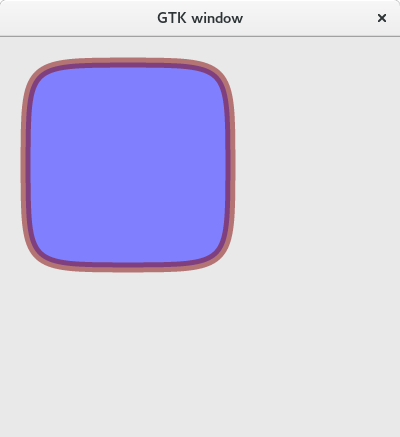

# cairoD [](https://travis-ci.org/cairoD/cairoD)

This is a D2 binding and wrapper for the [cairo](http://cairographics.org) graphics library.

Currently cairoD targets cairo version **1.10.2**.

Homepage: https://github.com/cairoD/cairoD

API Documentation: https://cairod.github.io/cairoD/api/cairo/cairo.html

## Examples

The cairoD library ships with some examples in the [examples](https://github.com/cairoD/cairoD/tree/master/examples) directory.
Some of these examples are ported from [cairographics.org](http://cairographics.org/samples/), some are original. To build these
examples, simply use dub:

```bash
dub run
```

On windows you have to manually copy the DLLs into the bin directory. Run
```bash
dub build
```
This will build the example and copy the executable to the bin directory. Then copy all DLLs from /lib/32 or /lib/64
into the bin directory and run the example.exe manually.

Some examples can directly present the results in a GTK2 or GTK3 window. Simply use the correct dub configurations:

```bash
dub run --config=gtk2
dub run --config=gtk3
```



## Building

You can use [dub] to make this library a dependency for your project.
[dub]: http://code.dlang.org/packages/cairod

### Windows support

cairoD can be used on windows, but it requires cairo DLLs and matching import libraries.
We provide a set of DLLs and import libraries in the [lib](https://github.com/cairoD/cairoD/tree/master/lib)
directory. Copy the lib folder into your dub project and then use this dub configuration to support
all windows compilers:

```json
    "libs-windows-x86-dmd": ["lib/32/mars/cairo"],
    "libs-windows-x86-gdc": ["lib/32/msvc_mingw/cairo"],
    "libs-windows-x86-ldc": ["lib/32/msvc_mingw/cairo"],
    "libs-windows-x86_64": ["lib/64/cairo"],
    "copyFiles-windows-x86": ["lib/32/*.dll"],
    "copyFiles-windows-x86_64": ["lib/64/*.dll"]
```

**Note:**
cairoD currently uses the [windows-headers](http://code.dlang.org/packages/windows-headers) package for the Win32Surface. Use the `CairoWindowsDruntime` version if you want to use the windows bindings shipped with D version 2.070+.

### Customizing the cairoD configuration
The cairo library provides certain features as optional extensions. CairoD
does not provide access to these extensions by default. To enable the extensions,
pass the matching version to your D compiler or specify the versions in your dub.json
file:

```json
"dependencies": {
    "cairod": {"version": "~>0.0.1"}
},
"versions": ["CairoPNG"]
```

The following versions are available:

| version name         | Cairo C feature            | Description                                     |
| -------------------- | -------------------------- | ----------------------------------------------- |
| CairoPNG             | CAIRO_HAS_PNG_FUNCTIONS    | Enable loading/saving of PNG files              |
| CairoPSSurface       | CAIRO_HAS_PS_SURFACE       | Enable cairo.ps module                          |
| CairoPDFSurface      | CAIRO_HAS_PDF_SURFACE      | Enable cairo.pdf module                         |
| CairoSVGSurface      | CAIRO_HAS_SVG_SURFACE      | Enable cairo.svg module                         |
| CairoFTFont          | CAIRO_HAS_FT_FONT          | Enable cairo.ft module (FreeType fonts)         |
| CairoWin32Surface    | CAIRO_HAS_WIN32_SURFACE    | Enable cairo.win32 module (rendering)           |
| CairoWin32Font       | CAIRO_HAS_WIN32_FONT       | Enable cairo.win32 module (fonts)               |
| CairoXlibSurface     | CAIRO_HAS_XLIB_SURFACE     | Enable cairo.xlib module                        |
| CairoXCBSurface      | CAIRO_HAS_XCB_SURFACE      | Enable cairo.xcb module                         |
| CairoDirectFBSurface | CAIRO_HAS_DIRECTFB_SURFACE | Enable cairo.directfb module                    |
| CairoWindowsDruntime | -                          | Use core.sys.windows instead of windows-headers |


## Links

- Cairo [homepage](http://cairographics.org).

## License

Distributed under the Boost Software License, Version 1.0.

See the accompanying file LICENSE_1_0.txt or view it [online][BoostLicense].

[BoostLicense]: http://www.boost.org/LICENSE_1_0.txt
